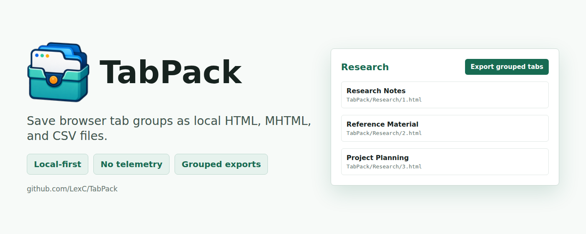

<p align="center">
  
</p>

# TabPack

**Save browser tab groups as local files.**

TabPack is a free and open-source Chromium extension for people who use browser
tab groups as working sets: research sessions, project references, reading
queues, investigations, documentation trails, and anything else worth keeping
outside the browser.

It exports grouped tabs from the current window as local HTML snapshots, HTML
asset folders, MHTML archives, or selected-page CSV indexes. No account, no
backend, no analytics, no telemetry.

[User Guide](docs/user-guide.md) · [Privacy Policy](PRIVACY.md) · [Developer Docs](docs/dev/) · [Store Assets](docs/store/screenshots/README.md) · [Changelog](CHANGELOG.md)

## Highlights

- Local-first export: files stay on your device.
- Group-aware workflow: ungrouped tabs are skipped by design.
- Selected-by-default review: deselect groups or individual tabs before export.
- Multiple formats: HTML, HTML + `_files`, MHTML, and CSV.
- Predictable output: numbered files, optional page-title filenames, and
  deterministic group folders.
- Runtime-scoped access: broad HTTP/HTTPS access is optional and requested only
  for HTML export modes.
- Store-ready packaging: validation, Playwright smoke tests, generated assets,
  and release ZIP builds are wired into one check.

## Screenshots

| Popup Summary | Export Preview |
| --- | --- |
|  |  |

| CSV Preview |
| --- |
|  |

## Install Unpacked

TabPack is a Manifest V3 extension for Chromium-based browsers such as
Microsoft Edge and Google Chrome.

```text
edge://extensions
chrome://extensions
```

Enable Developer mode, choose **Load unpacked**, and select the `extension/`
folder from this repository.

For the full walkthrough, export modes, folder behavior, permissions, and
troubleshooting, read the [User Guide](docs/user-guide.md).

## Output Shape

By default, TabPack writes grouped exports inside a `TabPack/` folder:

```text
Selected output folder/
  TabPack/
    Research/
      1.html
      1_files/
      2.html
      2_files/
    Reading Queue/
      1.html
      1_files/
    tab-groups.csv
```

The CSV file is written at the export root when CSV output or the optional
report is enabled.

## Documentation

| Area | Link |
| --- | --- |
| Use the extension | [User Guide](docs/user-guide.md) |
| Privacy and data handling | [Privacy Policy](PRIVACY.md) |
| Runtime architecture and conventions | [Developer Docs](docs/dev/) |
| Testing and release checks | [Testing Guide](docs/dev/testing.md) |
| Manual QA | [Manual Checklists](tests/manual/) |
| Store listing drafts and images | [Store Docs](docs/store/) |

## Development

Runtime extension files live in `extension/`. Repository-level files support
documentation, validation, testing, asset generation, and release packaging.

```text
npm install
npm run check
```

Useful commands:

```text
npm test
npm run validate
npm run capture:store-assets
npm run build
```

`npm run build` writes Edge and Chrome ZIP packages under `dist/`; generated
ZIPs are ignored by git.

## Contributing

Issues, fixes, documentation improvements, and careful feature ideas are
welcome. Please keep changes aligned with TabPack's core promise: local-first
tab-group export with clear user control over what gets written and where.

## License

TabPack is free and open-source software released under the [MIT License](LICENSE).
